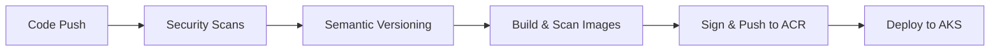

# 3-Tier MERN App - DevSecOps Pipeline (Project in Progress)

[](https://github.com/AkingbadeOmosebi/3-Tier-MERN-App/actions/workflows/devsecops-pipeline.yml)
[](https://github.com/AkingbadeOmosebi/3-Tier-MERN-App/security)
[](https://portal.azure.com)
[](./terraform)

## 🛡️ Security Pipeline Overview

This project implements a comprehensive **DevSecOps pipeline** with 8 security layers:

| Layer | Tool | Purpose | Status |
|-------|------|---------|--------|
| 1️⃣ Secret Detection | GitLeaks | Prevent credential leaks | ✅ Blocking |
| 2️⃣ Dependency Scanning | OWASP Dependency-Check | CVE detection (CVSS 7+) | ⚠️ Reporting |
| 3️⃣ SAST | SonarCloud | Code quality & security | ✅ Quality Gate |
| 4️⃣ Dockerfile Linting | Hadolint | Container best practices | ✅ Blocking |
| 5️⃣ Container Scanning | Trivy | Image vulnerability scan | ⚠️ Reporting |
| 6️⃣ SBOM Generation | Syft | Software Bill of Materials | ✅ Enabled |
| 7️⃣ Image Signing | Cosign | Supply chain security | ✅ Enabled |
| 8️⃣ OIDC Authentication | Azure | Passwordless deployment | ✅ Enabled |

## 🏗️ Infrastructure

**Cloud Provider:** Microsoft Azure  
**Container Registry:** Azure Container Registry (ACR)  
**Orchestration:** Azure Kubernetes Service (AKS) *(Coming Soon)*  
**IaC:** Terraform

## 🚀 CI/CD Pipeline


## 📦 Project Structure
```
.
├── .github/workflows/
│   └── devsecops-pipeline.yml    # Main CI/CD pipeline
├── terraform/
│   ├── oidc/                     # Azure OIDC configuration
│   ├── acr/                      # Container Registry
│   └── aks/                      # Kubernetes cluster (WIP)
├── MERN-APP/
│   ├── backend/                  # Node.js API
│   └── frontend/                 # React application
└── .releaserc.json              # Semantic release config
```

## 🔐 Security Features

- **Zero Secrets in Code:** OIDC authentication eliminates stored credentials
- **Automated Versioning:** Semantic release with conventional commits
- **Supply Chain Security:** Image signing with Cosign
- **Vulnerability Tracking:** SBOM generation for compliance
- **Defense in Depth:** Multiple security layers across SDLC

## 📝 Version History

See [CHANGELOG.md](./CHANGELOG.md) for release notes.

---

**Built with ❤️ by Aking Omosebi** | Cloud Platform Engineer