# Screenshot Documentation Guide

**Project:** 3-Tier MERN Application on Azure Kubernetes Service  
**Author:** Akingbade Omosebi  
**Date:** December 2025

---

## Overview

This guide documents all screenshots that demonstrate the working production environment. All images are stored in the `docs/images/` folder.

---

## Screenshot Inventory (15 Primary Screenshots)

### 1. Application & GitOps (3 screenshots)

#### Screenshot 1: Frontend Application with HTTPS
**File:** `01-frontend-https.png`

**Shows:** Live frontend application accessible via HTTPS at https://mern.ak-cloudtechdigital-az.info

**Demonstrates:**
- TLS certificate working (lock icon)
- Custom domain configured
- React application loading successfully
- nginx serving static content

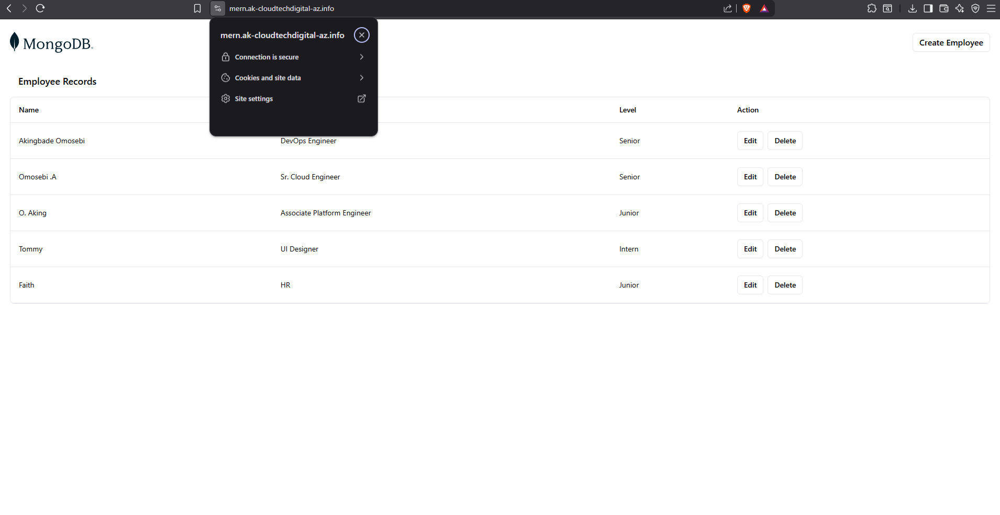

---

#### Screenshot 2: ArgoCD GitOps Dashboard
**File:** `02-argocd-dashboard.png`

**Shows:** ArgoCD dashboard displaying the mern-app Application with sync status

**Demonstrates:**
- GitOps deployment working
- Application health status (Healthy/Synced)
- Automatic sync from Git repository
- All resources managed declaratively

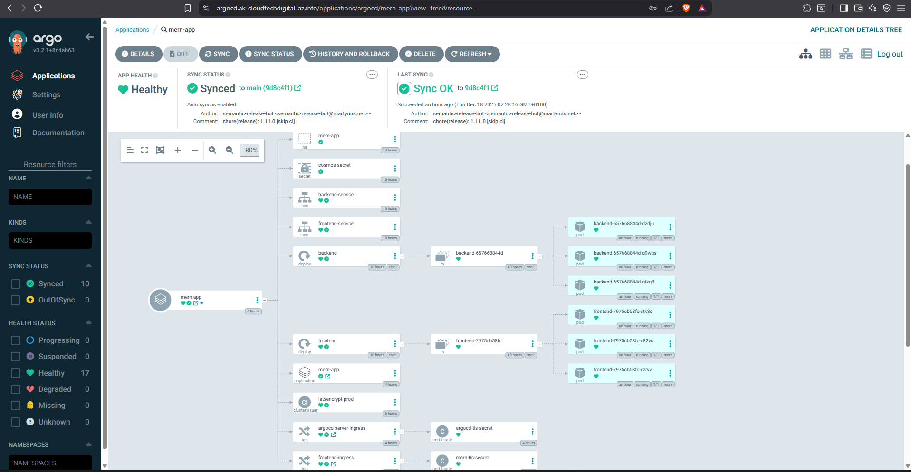

---

#### Screenshot 3: Grafana Monitoring Data
**File:** `07-grafana-data.png`

**Shows:** Grafana displaying real-time metrics from Prometheus

**Demonstrates:**
- Monitoring stack operational
- Metrics collection working
- Dashboard visualization
- Time-series data

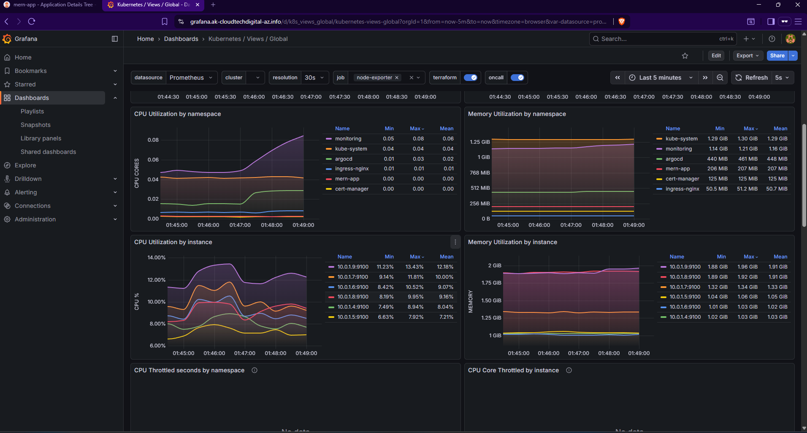

---

### 2. Kubernetes Resources (6 screenshots)

#### Screenshot 4: All Kubernetes Pods
**File:** `03-kubectl-pods-all.png`

**Command to reproduce:**
```bash
kubectl get pods -A
```

**Shows:** All pods running across 5 namespaces (mern-app, ingress-nginx, cert-manager, argocd, monitoring)

**Demonstrates:**
- 30+ application pods running
- High availability (3 replicas per service)
- All pods in Running state
- Multi-namespace architecture

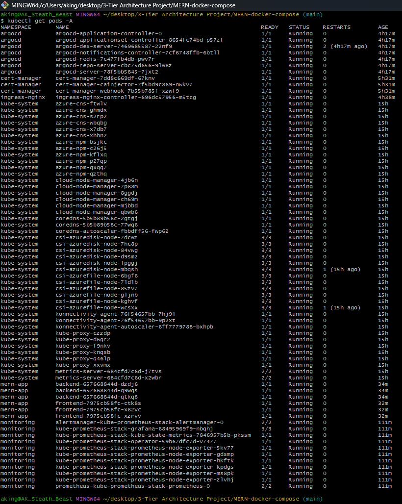

---

#### Screenshot 5: Ingress Resources
**File:** `04-kubectl-ingress.png`

**Command to reproduce:**
```bash
kubectl get ingress -n mern-app
```

**Shows:** Ingress resources with host-based routing rules and TLS configuration

**Demonstrates:**
- Single Ingress Controller architecture
- Host-based routing (mern, argocd, grafana subdomains)
- TLS termination
- Public IP assignment (172.199.124.213)

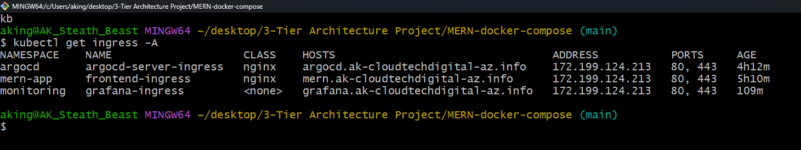

---

#### Screenshot 6: TLS Certificates
**File:** `05-kubectl-certificates.png`

**Command to reproduce:**
```bash
kubectl get certificates -A
```

**Shows:** Let's Encrypt TLS certificates managed by cert-manager

**Demonstrates:**
- Automatic certificate provisioning
- All certificates in Ready state
- 90-day validity with auto-renewal
- Multiple domains secured

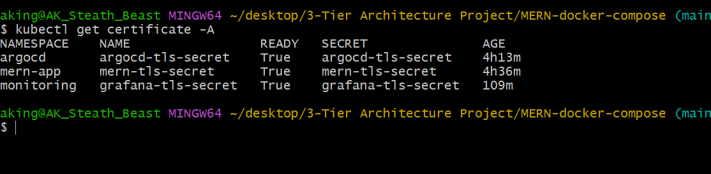

---

#### Screenshot 7: Application Deployments
**File:** `06-kubectl-deployments.png`

**Command to reproduce:**
```bash
kubectl get deployments,svc,pods -n mern-app
```

**Shows:** Backend and frontend deployments with replica counts

**Demonstrates:**
- High availability (3 replicas each)
- All replicas ready
- Deployment strategy
- Resource management

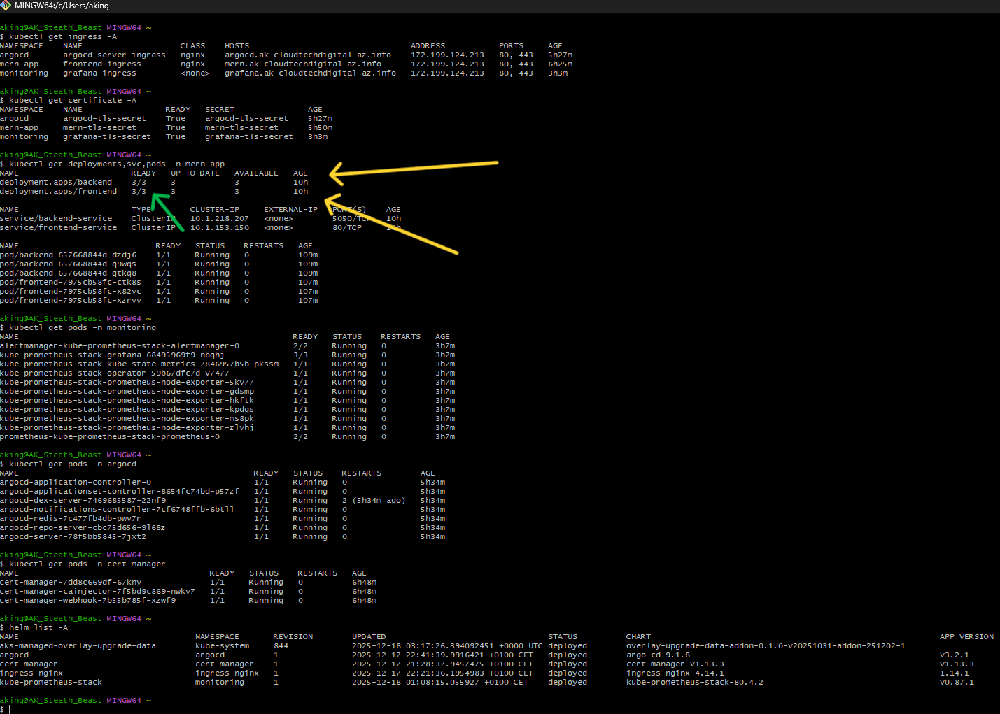

---

#### Screenshot 8: Grafana Dashboard Overview
**File:** `08-grafana-dashboard.png`

**Shows:** Complete Grafana dashboard with multiple panels showing cluster and application metrics

**Demonstrates:**
- Full observability stack
- Multiple data sources
- Custom dashboards
- Real-time monitoring

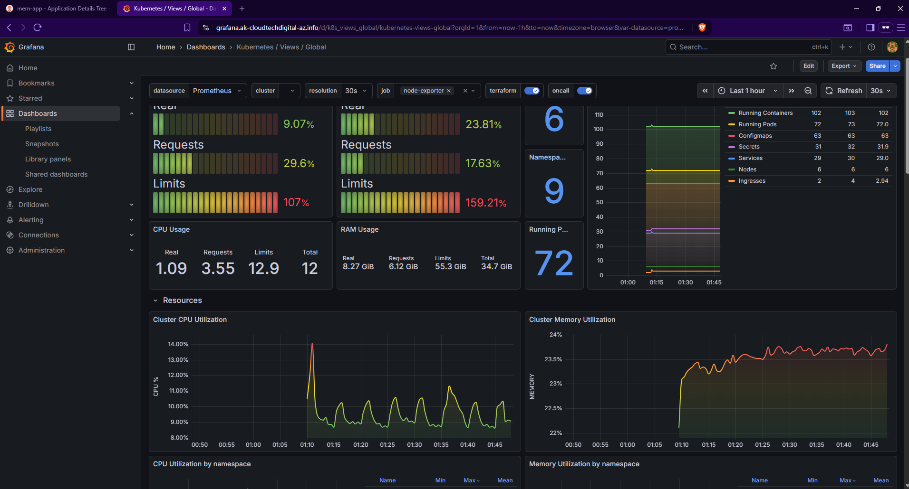

---

#### Screenshot 9: Helm Deployments
**File:** `16-helm-list.png`

**Command to reproduce:**
```bash
helm list -A
```

**Shows:** All Helm releases deployed (ingress-nginx, cert-manager, argocd, prometheus-stack)

**Demonstrates:**
- Helm package management
- Release versions
- Deployment namespaces
- Kubernetes applications managed via Helm

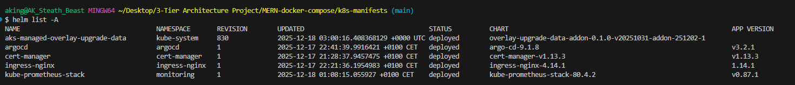

---

### 3. Monitoring & Alerts (2 screenshots)

#### Screenshot 10: Prometheus Alerts (Stable State)
**File:** `09-prometheus-alert-(stable).png`

**Shows:** Prometheus alert rules in stable/inactive state (no alerts firing)

**Demonstrates:**
- Alert rules configured
- Healthy system state
- Proactive monitoring setup
- No active incidents

.png)

---

#### Screenshot 11: Prometheus Alerts (Triggered State)
**File:** `10-prometheus-alert-(trigger).png`

**Shows:** Prometheus alert rules in triggered/firing state (demonstrating alert functionality)

**Demonstrates:**
- Alert system working
- Threshold detection
- Alert severity levels
- Incident detection capability

.png)

---

### 4. Azure Infrastructure (4 screenshots)

#### Screenshot 12: AKS Cluster Overview
**File:** `12-azure-aks.png`

**Shows:** Azure Portal displaying AKS cluster with 6 nodes, Running status, and Kubernetes version

**Demonstrates:**
- Azure Kubernetes Service deployed
- Node pool configuration (3 system + 3 user nodes)
- Cluster health status
- Kubernetes version

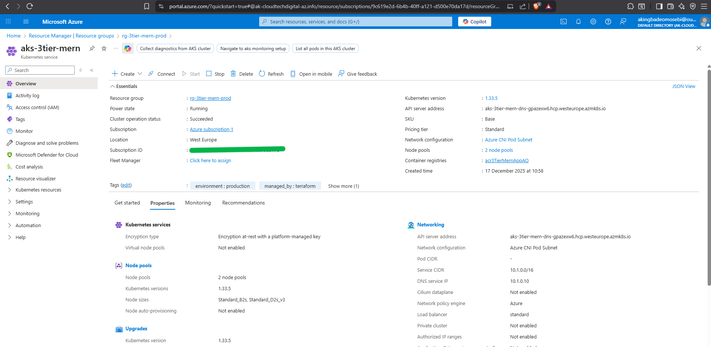

---

#### Screenshot 13: Azure Container Registry
**File:** `13-azure-acr.png`

**Shows:** ACR showing backend and frontend repositories with semantic version tags

**Demonstrates:**
- Container registry operational
- Semantic versioning (v1.x.x tags)
- Multiple image versions
- OIDC authentication configured

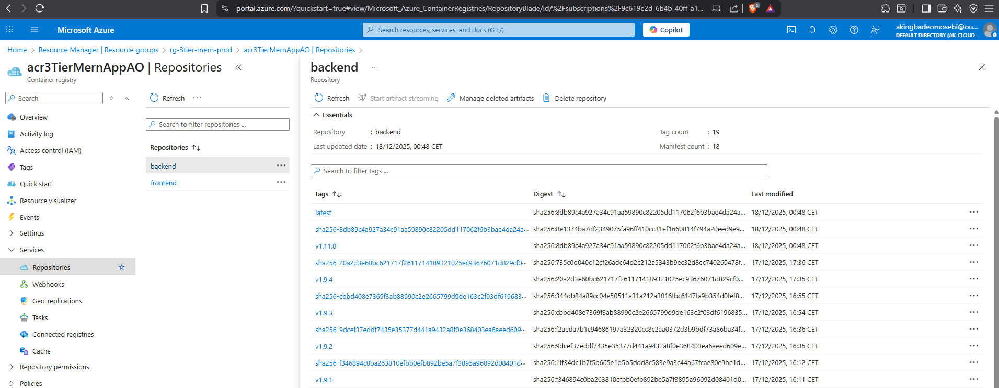

---

#### Screenshot 14: GitHub Actions CI/CD
**File:** `14-github-actions.png`

**Shows:** GitHub Actions workflow runs showing successful deployments

**Demonstrates:**
- Automated CI/CD pipeline
- DevSecOps workflow execution
- Terraform infrastructure deployment
- Build and deployment history

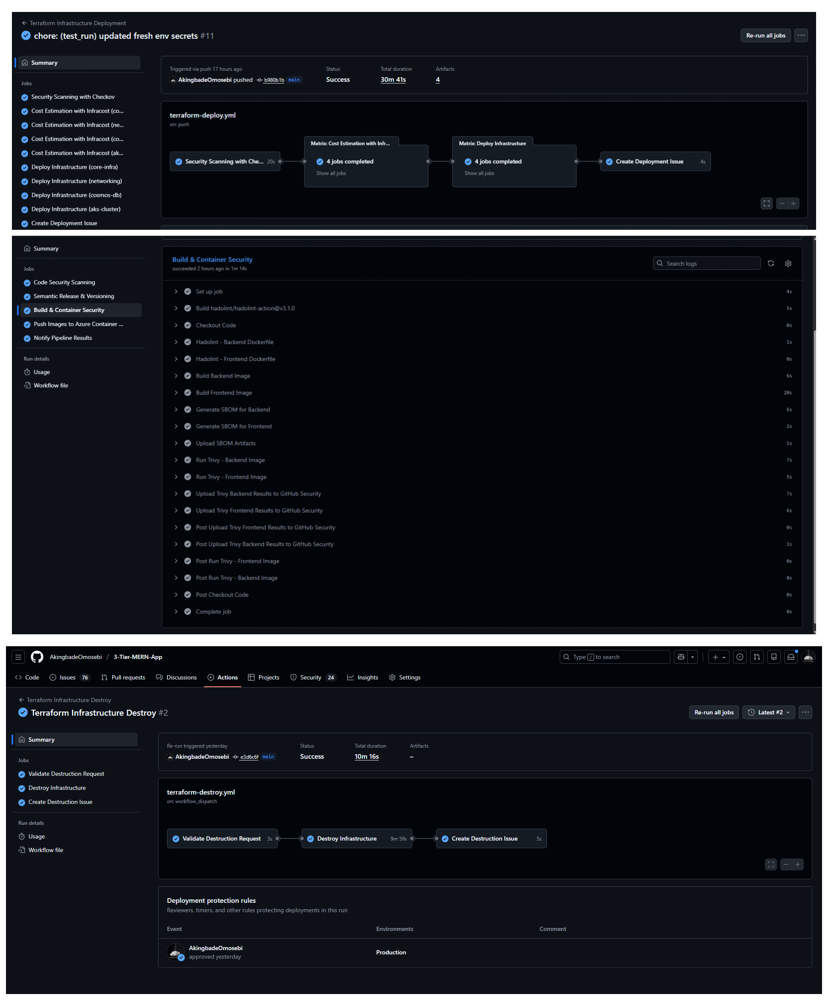

---

#### Screenshot 15: TLS Certificate Detail
**File:** `17-tls-certificate.png`

**Shows:** Detailed view of TLS certificate issued by Let's Encrypt

**Demonstrates:**
- Valid TLS certificate
- Certificate issuer (Let's Encrypt)
- Expiry date (90-day validity)
- Certificate chain of trust

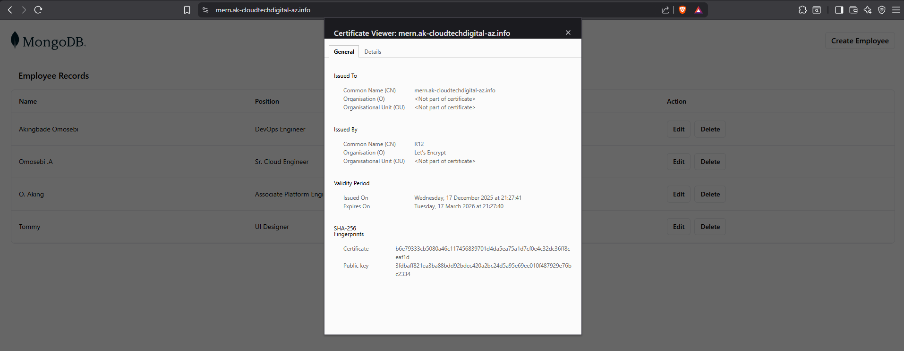

---


#### Screenshot 16: DNS Configuration (Namescheap)
**File:** `18-DNS-Config-NamesCheap.png`

**Shows:** Advanced DNS configuration for ingress and tls, for ease of use and in accessing App

**Demonstrates:**
- Understanding and purpose of DNS systems
- DNS lifecycle (renewal & procurement) 
- Advanced DNS configurations as domain & sub-domain
- DNS routing and propagation (DNS look-up via 'nslookup' and dns resolution)

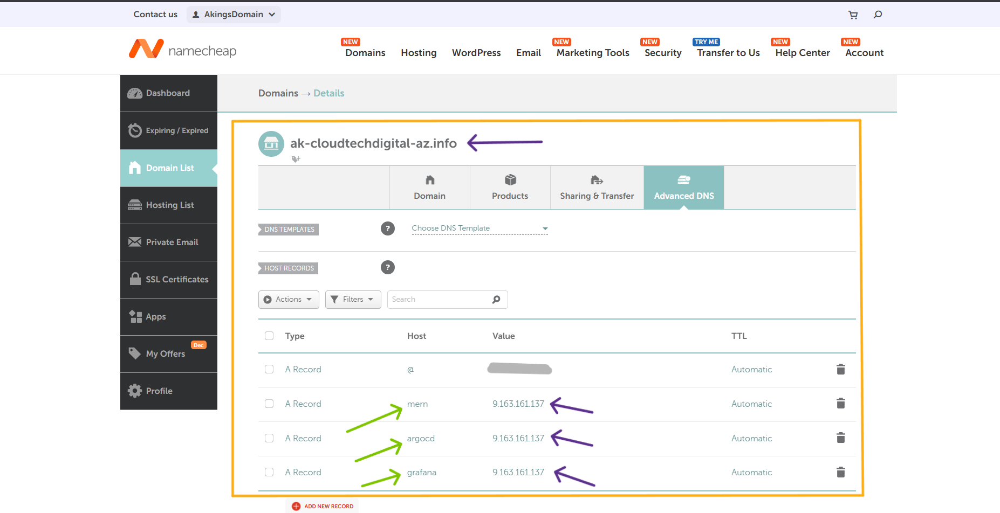

---

## Additional Azure Infrastructure Screenshots

These supplementary screenshots provide additional context about the Azure infrastructure setup:

### AKS Resource Group
**File:** `AKS resource Group.png`

Shows the managed resource group created by AKS containing node VMs, load balancers, and networking resources.


---

### AKS User Node Pool
**File:** `AKS user pool.png`

Shows the user node pool configuration with 3 nodes for running application workloads.


---

### Network Security Group Rules
**File:** `AKS-NSG.png`

Shows NSG rules allowing HTTP (80) and HTTPS (443) traffic to the Ingress Controller.

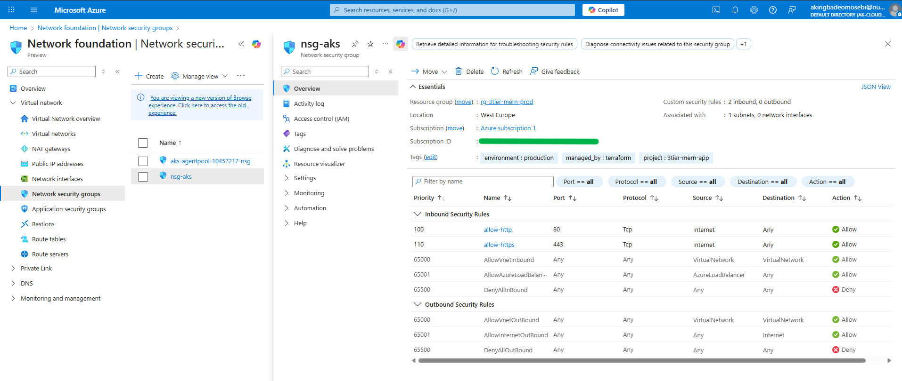

---

### Terraform Remote State Storage
**File:** `Azure Blob Storage for state.png`

Shows Azure Blob Storage container used for Terraform remote state management with state locking.


---

### Cosmos DB Instance
**File:** `Cosmos-DB.png`

Shows Azure Cosmos DB with MongoDB API configured for application data persistence.

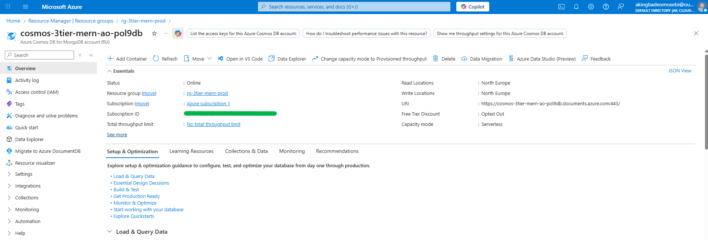

---

### Production Resource Group
**File:** `Production Resouce Group.png`

Shows the main production resource group containing all deployed Azure resources.


---

## Screenshot Categories Summary

**Primary Screenshots (15):**
- ✅ Frontend application (1)
- ✅ GitOps/ArgoCD (1)
- ✅ Kubernetes resources (6)
- ✅ Monitoring/Grafana (2)
- ✅ Prometheus alerts (2)
- ✅ Azure infrastructure (3)

**Supplementary Screenshots (6):**
- ✅ Azure resource groups (2)
- ✅ Network security (1)
- ✅ State storage (1)
- ✅ Database (1)
- ✅ Node pools (1)

**Total: 21 screenshots documenting the entire platform**

---

## How These Screenshots Are Used

### In README.md (9 key screenshots displayed in 3x3 grid):
1. `01-frontend-https.png` - Frontend application
2. `02-argocd-dashboard.png` - ArgoCD dashboard
3. `08-grafana-dashboard.png` - Grafana monitoring
4. `03-kubectl-pods-all.png` - All pods
5. `04-kubectl-ingress.png` - Ingress controller
6. `05-kubectl-certificates.png` - TLS certificates
7. `12-azure-aks.png` - AKS cluster
8. `13-azure-acr.png` - Container registry
9. `14-github-actions.png` - CI/CD pipeline

### In This Document (All 21 screenshots):
- Complete gallery with detailed explanations
- Commands to reproduce each screenshot
- What each screenshot demonstrates
- Technical context for each image

---

## File Naming Convention

**Numbered screenshots (primary documentation):**
- `01-` to `17-` prefix indicates sequence
- Descriptive name indicates content
- `.png` format for quality

**Named screenshots (supplementary):**
- Descriptive names without numbers
- Azure-specific resources
- Infrastructure details

---

## Screenshot Capture Locations

**Application URLs:**
- Frontend: https://mern.ak-cloudtechdigital-az.info
- ArgoCD: https://argocd.ak-cloudtechdigital-az.info
- Grafana: https://grafana.ak-cloudtechdigital-az.info

**kubectl Commands:**
```bash
kubectl get pods -A                    # All pods
kubectl get ingress -n mern-app        # Ingress resources
kubectl get certificates -A            # TLS certificates
kubectl get deployments -n mern-app    # Deployments
helm list -A                           # Helm releases
```

**Azure Portal:**
- Navigate to resource groups
- View AKS cluster details
- Check ACR repositories
- Review NSG rules

**GitHub Actions:**
- Go to Actions tab in repository
- View workflow runs
- Check deployment history

---

## Screenshot Quality Standards

All screenshots meet these criteria:

✅ **High resolution** - Clear, readable text  
✅ **Full context** - Complete UI elements visible  
✅ **Accurate timestamps** - Current deployment state  
✅ **Consistent naming** - Follows established convention  
✅ **Relevant content** - Shows working features  
✅ **Professional** - Clean captures without clutter

---

## For Hiring Managers & Reviewers

**Quick Validation (2 minutes):**
1. View the 9 screenshots in README.md (3x3 grid)
2. Confirms: frontend works, monitoring active, CI/CD deployed

**Deep Dive (15-30 minutes):**
1. Review this complete gallery
2. See all 21 screenshots with explanations
3. Understand entire architecture

**Technical Interview:**
- Screenshots prove working implementation
- Can discuss any component shown
- Evidence of production-grade deployment

---

## Notes

- All screenshots captured from live production environment
- Infrastructure has been destroyed after screenshot capture
- Screenshots serve as permanent documentation
- Can rebuild entire platform using documented code

---

**Documentation Date:** December 2025  
**Environment:** Production  
**Status:** Fully Operational (at time of screenshots)  
**Infrastructure:** Destroyed post-documentation
